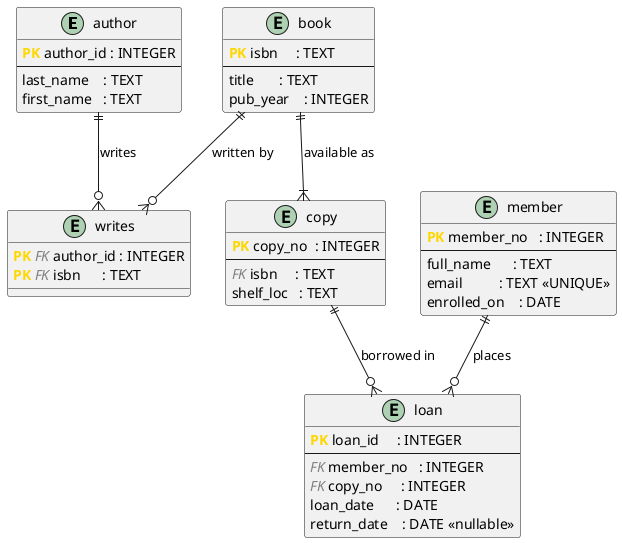

# DBMS_03 – From ER Diagram to Relational Schema: DDL, Keys, and Algebra in SQL

**Module:** Databases · THGA Bochum  
**Lecturer:** Stephan Bökelmann · <sboekelmann@ep1.rub.de>  
**Repository:** <https://github.com/MaxClerkwell/DBMS_03>  
**Prerequisites:** DBMS_01, DBMS_02, Lecture 03 (Relational Model)  
**Duration:** 90 minutes

---

## Learning Objectives

After completing this exercise you will be able to:

- Translate a conceptual ER diagram into a concrete relational schema
- Write DDL statements that enforce primary keys, foreign keys, and referential integrity rules
- Distinguish between a relation schema and a relation instance
- Express queries as relational algebra expressions and then write the equivalent SQL
- Observe what happens when integrity constraints are violated

**After completing this exercise you should be able to answer the following
questions independently:**

- What is the difference between a superkey, a candidate key, and a primary key?
- Why does a `LEFT OUTER JOIN` followed by a `WHERE` on the right-hand table
  silently revert to an inner join?
- When is a composite primary key the correct design choice, and when should a
  surrogate key be preferred?

---

## Check Prerequisites

```bash
sqlite3 --version
```

> You should see a line starting with `3.` followed by a date, e.g.
> `3.45.1 2024-01-30 ...`.  
> If the command is not found, install SQLite:
> ```bash
> sudo apt-get install -y sqlite3   # Debian / Ubuntu
> brew install sqlite3              # macOS
> ```

```bash
git --version
```

> Any version from 2.28 onward is sufficient.

> **Screenshot 1:** Take a screenshot of your terminal showing both version
> checks and insert it here.
>
> `[insert screenshot]`
>
> 


---

## Background

In DBMS_02 you designed a conceptual ER diagram for the Bochum City Library
using PlantUML. The diagram captured *what* entities and relationships exist.
In this exercise you turn that design into a *physical* relational schema –
the set of SQL tables, keys, and constraints that a real database management
system can enforce.

This translation from the ER level to the relational level is never automatic.
You must decide:

- Which entities become relations and which become attributes of other relations
- Which candidate key to designate as the primary key
- How N:M relationships are decomposed into a join relation
- Which referential action to assign to each foreign key

Lecture 03 gives you the formal vocabulary: a **relation** is a finite set of
**tuples**, each tuple assigning one **domain**-constrained value to every
**attribute**. The formal apparatus of the **relational algebra** – selection
(σ), projection (π), rename (ρ), join (⋈), union, difference – is the
mathematical layer underneath every SQL query you will write today.

---

## 0 – Fork and Clone the Repository

**Step 1 – Fork on GitHub:**  
Navigate to <https://github.com/MaxClerkwell/DBMS_03> and click **Fork**.
Keep the default settings and confirm.

**Step 2 – Clone your fork:**

```bash
git clone git@github.com:<your-username>/DBMS_03.git
cd DBMS_03
ls
```

> You should see `README.md`. The rest of the schema files you will create
> yourself during this exercise.

---

## 1 – From ER to Relational Schema

### Recap: the library ER diagram (DBMS_02)

The five entities from the library scenario map to relations as follows.
The rules for the translation are given in Lecture 02; here we apply them
systematically.

| ER Entity | Becomes relation | Primary key | Notes |
|-----------|-----------------|-------------|-------|
| Book      | `book`          | `isbn` (natural) | ISBN is globally unique and stable |
| Author    | `author`        | `author_id` (surrogate) | Names are not unique |
| Copy      | `copy`          | `copy_no` (surrogate) | Shelf copies of the same book |
| Member    | `member`        | `member_no` (surrogate) | |
| Loan      | `loan`          | `loan_id` (surrogate) | An event, not an entity with a natural key |

The **Author–Book** relationship is N:M; it needs a separate join relation:

| Join relation | Primary key | Foreign keys |
|---------------|-------------|-------------|
| `writes`      | `(author_id, isbn)` | → `author(author_id)`, → `book(isbn)` |

### Task 1 – Draw the relational schema on paper

Before touching the keyboard, sketch the six relations (including `writes`)
with their attributes, underline each primary key, and draw arrows for every
foreign key. Note the referential action you intend to assign (CASCADE,
RESTRICT, or SET NULL) on each arrow.

The conventional notation for a relation schema on paper writes the relation
name above a box, lists attributes inside it, underlines the primary key, and
marks foreign key attributes with `FK`. A small worked example using a
hypothetical two-table schema:

```
 department                      employee
┌──────────────────────┐        ┌─────────────────────────────────┐
│ dept_id   (PK) ──────┼──────► │ emp_id    (PK)                  │
│ name                 │  RES.  │ dept_id   (FK) ──────────────┐  │
│ budget               │        │ full_name                    │  │
└──────────────────────┘        │ hire_date                    │  │
                                 └─────────────────────────────┼──┘
                                   ON DELETE RESTRICT ◄────────┘
```

In the example above the arrow leaves `employee.dept_id` (FK) and points to
`department.dept_id` (PK). The label `RESTRICT` means: deleting a department
row is refused as long as employees still reference it.

Apply the same technique to the six library relations. Your sketch should make
the following visible at a glance:

- Which attributes form the primary key of each relation (underlined or marked PK)
- Which attributes are foreign keys (marked FK), and which PK they point to
- The referential action on each arrow (CASCADE / RESTRICT / SET NULL)

A possible partial sketch for two of the library relations:

```
 book                            copy
┌──────────────────────┐        ┌─────────────────────────────────┐
│ isbn        (PK)     │◄───┐   │ copy_no   (PK)                  │
│ title                │    │   │ isbn      (FK) ──────────────────┘
│ pub_year             │    │     shelf_loc
└──────────────────────┘    │   └─────────────────────────────────┘
                             └── ON DELETE RESTRICT, ON UPDATE CASCADE
```

Complete the sketch for all six relations (`author`, `book`, `writes`, `copy`,
`member`, `loan`) before proceeding to Task 2.

> **Question 1.1:** In the ER diagram `Author` and `Book` are connected by an
> N:M relationship. Why does this require a dedicated join relation in the
> relational model? What would go wrong if you stored multiple author IDs in a
> single column of `book`?
>
> *Your answer:*
>
> The relational model only allows atomic values ​​in each cell (1NF). Storing multiple author_ids in a single column of book (e.g., "1,2,3" or an array type) would violate this rule and make it impossible to:declare a foreign key to author (a foreign key can only point to a unique identifier, not a substring) — referential integrity collapses;
perform an efficient join between authors and books (the string would need to be parsed, preventing the use of any B-tree index);
perform simple queries like "how many books has author 2 written?" which would require textual pattern matching instead of a COUNT.
The table writes(author_id, isbn) solves all these problems by representing each edge of the N:M relationship with an atomic row, with two properly declared foreign keys and a composite primary key that prevents duplicates.

> **Question 1.2:** `loan_id` is a surrogate key even though a loan might seem
> to be uniquely identified by `(member_no, copy_no, loan_date)`. Name one
> realistic scenario in which that composite key would fail to be a candidate
> key.
>
> *Your answer:*
> The triplet (member_no, copy_no, loan_date) seems sufficient, but it fails in several realistic scenarios:Two loans of the same copy on the same day. A member borrows a book, returns it late morning, then borrows it again in the afternoon (for example, because they forgot to take a note). The three columns would have the same value on two different rows — a key collision.
Date granularity. loan_date is typed DATE, not DATETIME. Even if we switch to DATETIME, two transactions recorded in the same second by the cash register system would pose the same problem.
Stability. A composite event key is fragile: if the library decides tomorrow to add a dimension (branch, employee who recorded the loan), the primary key must be migrated. A loan_id substitution key is immutable and independent of business rules.
A numeric substitution key avoids all these pitfalls and keeps the foreign keys of other tables (should a granular table referencing a loan ever exist) compact.

---

## 2 – Write the DDL

Create and open `schema.sql` in the repository root using Vim:

```bash
vim schema.sql
```

> If you have never used Vim before, run `vimtutor` in your terminal first —
> it is a self-contained 30-minute interactive lesson that teaches everything
> you need for this exercise. Come back here once you have completed it.
>
> The essential commands for now:
> - `i` — enter Insert mode (you can type)
> - `Esc` — return to Normal mode
> - `:w` — save the file
> - `:wq` — save and quit
> - `:q!` — quit without saving

### Task 2a – Implement the schema

Write `CREATE TABLE` statements for all six relations. Requirements:

- Every table must have a `PRIMARY KEY` constraint.
- Every foreign key must be declared with an explicit `ON DELETE` and
  `ON UPDATE` action.
- Use the most restrictive action that still makes the domain correct
  (prefer `RESTRICT` unless the scenario clearly calls for `CASCADE`).
- All surrogate keys use `INTEGER PRIMARY KEY` (SQLite's auto-increment
  mechanism) or `SERIAL PRIMARY KEY` (PostgreSQL). Pick one DBMS and stay
  consistent.
- `loan.return_date` must be nullable (a loan that has not been returned yet
  has no return date).

<details>
<summary>Solution skeleton – fill in the missing pieces before looking</summary>

```sql
CREATE TABLE author (
    author_id INTEGER PRIMARY KEY,
    last_name  TEXT NOT NULL,
    first_name TEXT NOT NULL
);

CREATE TABLE book (
    isbn       TEXT    PRIMARY KEY,
    title      TEXT    NOT NULL,
    pub_year   INTEGER NOT NULL
);

CREATE TABLE writes (
    author_id INTEGER NOT NULL,
    isbn      TEXT    NOT NULL,
    PRIMARY KEY (author_id, isbn),
    FOREIGN KEY (author_id) REFERENCES author(author_id)
        ON DELETE RESTRICT ON UPDATE CASCADE,
    FOREIGN KEY (isbn)      REFERENCES book(isbn)
        ON DELETE RESTRICT ON UPDATE CASCADE
);

CREATE TABLE copy (
    copy_no    INTEGER PRIMARY KEY,
    isbn       TEXT    NOT NULL,
    shelf_loc  TEXT    NOT NULL,
    FOREIGN KEY (isbn) REFERENCES book(isbn)
        ON DELETE RESTRICT ON UPDATE CASCADE
);

CREATE TABLE member (
    member_no    INTEGER PRIMARY KEY,
    full_name    TEXT    NOT NULL,
    email        TEXT    NOT NULL UNIQUE,
    enrolled_on  DATE    NOT NULL
);

CREATE TABLE loan (
    loan_id     INTEGER PRIMARY KEY,
    member_no   INTEGER NOT NULL,
    copy_no     INTEGER NOT NULL,
    loan_date   DATE    NOT NULL,
    return_date DATE,           -- NULL while still on loan
    FOREIGN KEY (member_no) REFERENCES member(member_no)
        ON DELETE RESTRICT ON UPDATE CASCADE,
    FOREIGN KEY (copy_no)   REFERENCES copy(copy_no)
        ON DELETE RESTRICT ON UPDATE CASCADE
);
```

</details>

### Task 2b – Load the schema into SQLite

```bash
sqlite3 library.db < schema.sql
```

> Verify that all six tables were created:
>
> ```bash
> sqlite3 library.db ".tables"
> ```
>
> You should see: `author  book  copy  loan  member  writes`

> **Screenshot 2:** Take a screenshot of the terminal showing the `.tables`
> output and insert it here.
>
> `[insert screenshot]`
> 


### Task 2c – Commit

You have just made a design decision that is worth preserving. The `schema.sql`
file is not just a configuration file – it is a precise, executable description
of how you model the library domain. Every constraint you wrote, every
referential action you chose, encodes a rule about how the real world works.
That reasoning should never be lost.

This is the core promise of version control: **you cannot lose work that has
been committed.** A file saved on disk can be overwritten by accident, deleted,
or corrupted. A committed snapshot cannot. Git stores every version you commit
in a content-addressed object store; even if you later rewrite the file
completely, the old version remains reachable by its hash and can be restored
at any time. Your schema today is a baseline. Every future `ALTER TABLE`,
every added constraint, every corrected cardinality will appear as a readable
diff on top of it — a permanent audit trail of how your understanding of the
domain evolved.

In professional teams this matters even more. A database migration that goes
wrong in production can be traced back to its commit, reviewed, and reverted.
The commit message is the one place where you record *why* a change was made —
not what (the diff shows that), but the reasoning behind it. A message like
`"feat: initial relational schema for library management"` tells a future
reader: this was intentional, this was the starting point, this is what we
agreed on.

Get into the habit of committing every time you reach a stable, meaningful
state — not only when you are "done". Done is a myth in software; stable and
described is achievable right now.

```bash
git add schema.sql
git commit -m "feat: initial relational schema for library management"
```

Verify that the commit was recorded:

```bash
git log --oneline
```

> You should see your commit at the top, with its short hash and message.
> That hash is now a permanent address for this exact version of your schema.
> Nothing can change it without you knowing.

### Questions for Task 2

**Question 2.1:** You declared `ON DELETE RESTRICT` on both foreign keys of
`writes`. What does this mean in practice if a librarian wants to delete an
author who has written at least one book in the catalogue?

> *Your answer:*
>
>When a librarian tries to delete an author who has at least one entry in writes, the query fails with FOREIGN KEY constraint failed and the deletion is rolled back. In practice, to truly delete the author, the librarian must first: either delete all entries in writes that reference them (and possibly all copies/orphaned books),or reassign the books to another author.
This is exactly the desired behavior: the record of a book being written by someone is never silently lost.

**Question 2.2:** `email` in `member` is declared `UNIQUE` but is not the
primary key. Using the vocabulary from Lecture 03, what kind of key is it?

> *Your answer:*
> 
>email is an alternate candidate key (Reading 03, sometimes called an alternate key in English or Alternativschlüssel in German). It satisfies the two conditions of a candidate key:
Uniqueness: declared by the UNIQUE constraint.
Non-redundancy: only one attribute, therefore trivially minimal.
But it is not the primary key: we chose member_no because it is shorter (an INTEGER vs. a variable-length string), more stable (a member can change their email, but their member_no never can), and performs better for joins.
Complete vocabulary:
Superkey = a set of attributes that uniquely identify a row (e.g., {member_no, full_name}).
Candidate key = minimal superkey (no sub-part is yet a superkey).
Primary key = the candidate key designated as the main identifier.
Alternate key = any other candidate key, such as email here.

**Question 2.3:** SQLite does not enforce `CHECK` or `FOREIGN KEY` constraints
by default. Run the following and observe what happens:
>
> ```sql
> PRAGMA foreign_keys = OFF;
> INSERT INTO loan (member_no, copy_no, loan_date) VALUES (9999, 9999, '2026-01-01');
> SELECT * FROM loan;
> ```
>
> Then run:
>
> ```sql
> PRAGMA foreign_keys = ON;
> DELETE FROM loan WHERE member_no = 9999;
> INSERT INTO loan (member_no, copy_no, loan_date) VALUES (9999, 9999, '2026-01-01');
> ```
>
> What error do you get in the second attempt? What does this tell you about
> the difference between a constraint declared in DDL and one actually enforced
> at runtime?

> *Your answer:*
>
> Error: FOREIGN KEY constraint failed
A constraint written in the DDL is merely a statement of intent. For it to truly protect data, the engine must verify it with every modification. In SQLite, this verification is disabled by default for historical compatibility reasons (versions prior to 3.6.19 did not support foreign keys; to avoid breaking existing databases, enforcement remains opt-in). A rigorous schema is therefore useless if the application code omits the PRAGMA foreign_keys = ON statement. In PostgreSQL, MySQL/InnoDB, or Oracle, foreign keys are enabled by default, and this pitfall does not exist.

---

## 3 – Insert Sample Data

Open a new file called `data.sql` in Vim:

```bash
vim data.sql
```

> If you have not yet run `vimtutor`, do it now before continuing — the
> commands from Task 2 (`i`, `Esc`, `:w`, `:wq`) are all you need here as
> well.

Type the following data set into the file:

```sql
-- Authors
INSERT INTO author VALUES (1, 'Date',    'C. J.');
INSERT INTO author VALUES (2, 'Ramakrishnan', 'Raghu');
INSERT INTO author VALUES (3, 'Gehrke',  'Johannes');

-- Books
INSERT INTO book VALUES ('978-0-201-96426-4', 'An Introduction to Database Systems', 2004);
INSERT INTO book VALUES ('978-0-072-46563-1', 'Database Management Systems',         2002);
INSERT INTO book VALUES ('978-0-13-110362-7', 'The C Programming Language',          1988);

-- Authorship
INSERT INTO writes VALUES (1, '978-0-201-96426-4');
INSERT INTO writes VALUES (2, '978-0-072-46563-1');
INSERT INTO writes VALUES (3, '978-0-072-46563-1');

-- Copies
INSERT INTO copy VALUES (1, '978-0-201-96426-4', 'A-01');
INSERT INTO copy VALUES (2, '978-0-201-96426-4', 'A-02');
INSERT INTO copy VALUES (3, '978-0-072-46563-1', 'B-07');
INSERT INTO copy VALUES (4, '978-0-13-110362-7', 'C-12');

-- Members
INSERT INTO member VALUES (101, 'Müller, Anna',     'a.mueller@stud.thga.de',     '2025-10-01');
INSERT INTO member VALUES (102, 'Schneider, Björn', 'b.schneider@stud.thga.de',   '2025-10-01');
INSERT INTO member VALUES (103, 'Koch, Clara',      'c.koch@stud.thga.de',        '2026-04-01');

-- Loans  (Koch has never borrowed anything)
INSERT INTO loan VALUES (1, 101, 1, '2026-04-09', '2026-04-23');
INSERT INTO loan VALUES (2, 102, 3, '2026-04-09', NULL);
INSERT INTO loan VALUES (3, 101, 2, '2026-04-16', NULL);
```

Load it:

```bash
sqlite3 library.db < data.sql
```

> Verify the row counts:
>
> ```sql
> SELECT 'author', COUNT(*) FROM author
> UNION ALL SELECT 'book',   COUNT(*) FROM book
> UNION ALL SELECT 'copy',   COUNT(*) FROM copy
> UNION ALL SELECT 'member', COUNT(*) FROM member
> UNION ALL SELECT 'writes', COUNT(*) FROM writes
> UNION ALL SELECT 'loan',   COUNT(*) FROM loan;
> ```
>
> You should see: 3, 3, 4, 3, 3, 3.

Commit:

```bash
git add data.sql
git commit -m "feat: add sample data for library schema"
```

---

## 4 – Relational Algebra → SQL

For each task below, first write out the relational algebra expression, then
translate it to SQL, then execute the query against `library.db` and record
the result.

### Task 4a – Selection (σ)

**Query:** All copies whose shelf location starts with `A`.

Algebra:
$$\sigma_{\mathrm{shelf\_loc}\ \mathrm{LIKE}\ \texttt{'A\%'}}(\textsc{copy})$$

SQL:

```sql
-- write your query here

SELECT *
FROM   copy
WHERE  shelf_loc LIKE 'A%';
```

> Expected result: copy\_no 1 and 2.

### Task 4b – Projection (π)

**Query:** The title and publication year of every book – no other columns.

Algebra:
$$\pi_{\mathrm{title},\,\mathrm{pub\_year}}(\textsc{book})$$

SQL:

```sql
-- write your query here

SELECT title, pub_year
FROM   book;
```

> Expected result: three rows, two columns each.

### Task 4c – Composition of σ and π

**Query:** The ISBN and shelf location of all copies on shelf row `B` or later
(i.e. `shelf_loc >= 'B'`).

Algebra:
$$\pi_{\mathrm{isbn},\,\mathrm{shelf\_loc}}\!\left(\sigma_{\mathrm{shelf\_loc} \geq \texttt{'B'}}(\textsc{copy})\right)$$

SQL:

```sql
-- write your query here

SELECT isbn, shelf_loc
FROM   copy
WHERE  shelf_loc >= 'B';
```

> Expected result: copy\_no 3 (B-07) and copy\_no 4 (C-12).

### Task 4d – Equi-Join (⋈)

**Query:** For every loan that has not yet been returned, list the member's
full name and the title of the book they have borrowed.

Algebra:
$$\pi_{\mathrm{full\_name},\,\mathrm{title}}\!\left(
  \sigma_{\mathrm{return\_date}\ \mathrm{IS\ NULL}}(\textsc{loan})
  \bowtie_{\mathrm{loan.member\_no}=\mathrm{member.member\_no}} \textsc{member}
  \bowtie_{\mathrm{loan.copy\_no}=\mathrm{copy.copy\_no}} \textsc{copy}
  \bowtie_{\mathrm{copy.isbn}=\mathrm{book.isbn}} \textsc{book}
\right)$$

SQL:

```sql
-- write your query here

SELECT m.full_name,
       b.title
FROM   loan   AS l
JOIN   member AS m ON l.member_no = m.member_no
JOIN   copy   AS c ON l.copy_no   = c.copy_no
JOIN   book   AS b ON c.isbn      = b.isbn
WHERE  l.return_date IS NULL;
```

> Expected result: two rows – Schneider borrowing *Database Management Systems*,
> Müller borrowing *An Introduction to Database Systems*.

### Task 4e – Left Outer Join

**Query:** All members and the number of books they currently have on loan
(including members with zero active loans).

SQL:

```sql
SELECT m.full_name,
       COUNT(l.loan_id) AS active_loans
FROM   member AS m
LEFT OUTER JOIN loan AS l
    ON m.member_no = l.member_no
   AND l.return_date IS NULL
GROUP BY m.member_no, m.full_name;
```

> Expected result: Müller 1, Schneider 1, Koch 0.

**Question 4.1:** The condition `l.return_date IS NULL` is in the `ON` clause,
not in a `WHERE` clause. What would happen to Koch's row if you moved this
condition into `WHERE return_date IS NULL`? Why? Refer to the formal definition
of the outer join from Lecture 03.

> *Your answer:*
>
> Any condition relating to the right-hand table of a LEFT JOIN must be placed in the ON clause. In the WHERE clause, only allow conditions relating to the left-hand table, or conditions explicitly compatible with NULL (IS NULL / IS NOT NULL), and only when you actually want to filter out synthetic rows. This rule avoids the anti-pattern entirely, without having to reason on a case-by-case basis.

### Task 4f – Set Difference

**Query:** Books that have never been borrowed (i.e. no copy of this book
appears in any loan).

Use a set-difference approach:

$$\pi_{\mathrm{isbn}}(\textsc{book}) - \pi_{\mathrm{isbn}}\!\left(\textsc{copy} \bowtie_{\mathrm{copy.copy\_no}=\mathrm{loan.copy\_no}} \textsc{loan}\right)$$

In SQL, set difference is expressed with `EXCEPT`:

```sql
-- write your query here

SELECT b.isbn, b.title
FROM   book AS b
WHERE  b.isbn NOT IN (
    SELECT c.isbn
    FROM   copy AS c
    JOIN   loan AS l ON c.copy_no = l.copy_no
);
```

> Expected result: *The C Programming Language* (copy 4 was never loaned).

Commit all your queries in a file called `queries.sql`:

```bash
git add queries.sql
git commit -m "feat: relational algebra queries translated to SQL"
```

---

## 5 – Referential Integrity in Practice

This section deliberately tries to break the database to observe how
constraints protect it.

### Task 5a – Insert an orphaned loan

```sql
PRAGMA foreign_keys = ON;

INSERT INTO loan (member_no, copy_no, loan_date)
VALUES (999, 1, '2026-05-01');
```

> Expected: an error like `FOREIGN KEY constraint failed`.  
> Member 999 does not exist.

> **Question 5.1:** Which specific constraint fired? Name the table and the
> foreign key column involved.
>
> *Your answer:*
>
```
Result: sqlite3.IntegrityError: FOREIGN KEY constraint failed

The FOREIGN KEY constraint (member_no) REFERENCES member(member_no) of the loan table failed. Member 999 does not exist in member, so the insertion violates referential integrity. SQLite does not specify the exact foreign key in its error message (this is a historical weakness of the engine), but we can deduce it because copy_no = 1 exists (a copy is present) — it must be member_no that is causing the problem. PostgreSQL would have specified: Key (member_no)=(999) is not present in table "member".
```

### Task 5b – Delete a member with active loans

```sql
DELETE FROM member WHERE member_no = 102;
```

> Expected: an error. The `ON DELETE RESTRICT` on `loan.member_no` prevents
> deleting a member who still has open loans.

> **Question 5.2:** Change the scenario: suppose you declare
> `ON DELETE CASCADE` on `loan.member_no` instead of `RESTRICT`. Run the same
> `DELETE`. What happens to Schneider's loan row? Is this behaviour desirable
> for a library system? Justify your answer.
>
> *Your answer:*
>
```
With ON DELETE CASCADE on loan.member_no, the DELETE FROM member WHERE member_no = 102 would succeed silently, and all loan lines referencing Schneider would be cascaded down — including the currently open loan 2 on copy 3.
```
### Task 5c – Verify the composite primary key of `writes`

```sql
INSERT INTO writes VALUES (1, '978-0-201-96426-4');
```

> Expected: an error because this `(author_id, isbn)` pair already exists.

> **Question 5.3:** The composite key `(author_id, isbn)` is a *candidate key*
> here – but also a *primary key*. Can a relation have two candidate keys? Give
> an example from the library schema.
>
> *Your answer:*
>
> Yes, and writes is a good theoretical example: the combination (author_id, isbn) is the only candidate key here because they are the only two attributes and they are both necessary (neither is sufficient on its own in the presence of N:M).

---

## 6 – Schema Diagrams as Code (Connection to DBMS_02)

In DBMS_02 you created a PlantUML entity-relationship diagram. Now that you
have a concrete relational schema, you can generate a *schema diagram* – a
diagram that shows tables, their columns, primary keys, and foreign keys – from
the same Docs-as-Code principle.

Create `schema.puml` with the following content (one entity block per table,
using PlantUML IE notation):



Render it locally:

```bash
plantuml -tsvg schema.puml
```

To view the result, open `schema.svg` in a web browser. How you get the file
there depends on where you are working.

**If you are working on your own machine**, navigate to the file directly:

```bash
xdg-open schema.svg
```

**If you are working on the student server**, the file exists on the server
but your browser runs on your local machine. You cannot open a remote file
path in a local browser directly. Instead, copy the file to your own machine
first using `scp` (Secure Copy Protocol). `scp` transfers files over SSH using
the same credentials and host address you use to log in:

```bash
scp <username>@<server>:/path/to/DBMS_03/schema.svg ~/Downloads/schema.svg
```

Replace `<username>`, `<server>`, and the path with the values for your
student account. Once the transfer completes, open the file from your local
`Downloads` folder in any browser.

If you have not used `scp` before, work through this exercise first:
[STEMgraph: SCP – Secure Copy Protocol](https://github.com/STEMgraph/301394c2-6efb-4677-aaff-47091fb8145d)

> **Screenshot 3:** Take a screenshot of `schema.svg` showing all six entities
> and all five relationships, and insert it here.
>
> `[insert screenshot]`
>
> 


Add `schema.svg` to `.gitignore` (it is generated, not authored):

```bash
echo "schema.svg" >> .gitignore
echo "*.db"       >> .gitignore   # SQLite database files are also generated
git add schema.puml .gitignore
git commit -m "docs: add relational schema diagram in PlantUML"
```

---

## Excursus: Schema, Instance, and the Cost of Schema Changes

In Lecture 03 a sharp distinction is drawn between the **relation schema**
(the structural description: attribute names, domains, constraints) and the
**relation instance** (the concrete tuples stored at a given moment). The
schema changes seldom; the instance changes with every write.

This distinction matters enormously in practice. Adding a column to a large
table is a *schema change*. In many production databases with millions of rows
it requires an `ALTER TABLE` that locks the table for seconds or minutes,
during which no writes are possible. Removing a column that other tables or
applications reference may silently break queries that rely on positional
column access (`SELECT *`) rather than named columns.

The lesson: treat the schema as a public API. Change it deliberately, test the
migration, and document the reason. The `schema.sql` file in this repository
is exactly that documentation – a version-controlled, diff-friendly record of
every structural decision. Together with the PlantUML diagram it forms a
complete, human-readable description of the relational model underlying the
application.

---

## Reflection

**Question A – Algebra to SQL:**  
Look at Task 4d. The algebra expression chains four relations with three
joins. SQL does not prescribe an execution order; the query optimizer may
reorder these joins freely. Under what condition would reordering a join change
the *result* of a query? Under what condition is it always safe?

> *Your answer:*
>
> The natural join (and equi-join) is: Commutative: R ⋈ S = S ⋈ R (the order of the operands does not affect the result).
Associative: (R ⋈ S) ⋈ T = R ⋈ (S ⋈ T), provided that all joins are inner joins.Outer join. (A ⟕ B) ⋈ C ≠ A ⟕ (B ⋈ C) in general. The LEFT OUTER join produces NULL values ​​for unpaired rows in A, and the subsequent inner join can eliminate these synthetic rows. This is precisely the pitfall of question 4.1.
Non-equijoin join conditions. With inequality conditions (R.x < S.y), associativity still holds, but the optimizer has far fewer usable index options. Presence of aggregation in the middle. A join followed by a GROUP BY produces a particular multiset; moving the join can change the cardinality.
These properties form the basis of the query optimizer: it can choose the order that minimizes the size of the intermediate results, since the final result is mathematically identical.

**Question B – NULL semantics:**  
`return_date` is `NULL` for an open loan. `NULL` in SQL does not mean zero or
false – it means *unknown*. Consider the query `WHERE return_date = NULL`.
Will it return the open loans? Explain why or why not and write the correct
form.

> *Your answer:*
>
> WHERE return_date = NULL always returns zero rows, regardless of the database state.

Why? SQL uses a three-value logic: TRUE, FALSE, UNKNOWN. Any comparison involving NULL (including NULL = NULL) produces UNKNOWN, because NULL means "unknown value," and you cannot compare two unknowns. The WHERE clause only retains a row if its predicate is strictly TRUE—therefore, it rejects UNKNOWN just like FALSE.

**Question C – Surrogate vs. natural key:**  
`book` uses `isbn` as its natural primary key; all other entities use surrogate
integer keys. Suppose the library occasionally receives books without an ISBN
(unpublished manuscripts, internal reports). How would this affect the `isbn`
primary key? What design change would you make?

> *Your answer:*
>
> The ISBN TEXT PRIMARY KEY NOT NULL prevents the insertion of a manuscript without an ISBN. Since the primary key is NOT NULL by definition, you can't even use NULL as a placeholder. Furthermore, inventing a fake ISBN ("INTERNAL-001") corrupts the field's semantics and could potentially collide with a real ISBN one day.
>
> The substitution key book_id INTEGER PRIMARY KEY, ISBN becomes a UNIQUE NULLABLE attribute.
> CREATE TABLE book (
       book_id  INTEGER PRIMARY KEY,
       isbn     TEXT    UNIQUE,        -- nullable
       title    TEXT    NOT NULL,
       pub_year INTEGER NOT NULL
   );
>
> Keep the ISBN as the primary key and synthesize an internal identifier. For example, use a prefix LIB- followed by a counter: LIB-2026-00001. This is a quick solution to implement, but it pollutes the ISBN field with non-standard values, breaking imports/exports and third-party tools (WorldCat, Goodreads, etc.). It should be avoided in practice.
Two separate tables (published_book, unpublished_book). On paper, this is clean (one type for real ISBNs, another for manuscripts); in practice, it's a nightmare because the foreign keys for copy, writes, and loan must now reference a union—impossible without triggers or an artificial parent table.

**Question D – Relational algebra limitations:**  
Suppose the library wants to find all members who have borrowed the same copy
more than once (the copy was returned and then borrowed again). Write the SQL
query. Now consider: could you express this query purely in the five basic
operators of the relational algebra (σ, π, ρ, ×, −) without aggregation?
What does this tell you about the relationship between relational algebra and
SQL?

> *Your answer:*
>
> Renaming one copy of `loan` to `l1` and another to `l2`: ρ.
Cartesian product: ×.

Selecting `l1.member_no = l2.member_no` ∧ `l1.copy_no = l2.copy_no` ∧ `l1.loan_id < l2.loan_id`: σ.

Projecting `(member_no, copy_no)`: π.

Basic relational algebra naturally handles multisets if we follow the "pure set theory" definition (projection eliminates duplicates). No aggregation is needed.

But the COUNT > 1 version does NOT allow this. Basic relational algebra does not have aggregation. COUNT, SUM, AVG, MAX, MIN, and GROUP BY are extensions added by Codd himself (extended relational algebra) and later standardized by SQL.

Basic algebra is relationally complete: it can express any purely set-theoretic query on relations. This is Codd's central theorem (1972).

But SQL is strictly more expressive because it allows aggregation, sorting (ORDER BY), recursive queries (WITH RECURSIVE), analytic windows (OVER (PARTITION BY …)), and NULL values ​​with their trivalued logic. None of these features are present in basic algebra.

This is why we speak of "extended relational algebra" in practice—basic algebra is a remarkable educational tool but insufficient for real-world business needs.

> **Screenshot 4:** Take a screenshot of your terminal showing the output of
> the query from Task 4d (the join across four relations), and insert it here.
>
> `[insert screenshot]`
>
> 


---

## Bonus Tasks

1. **Third normal form check:** Is the `copy` relation in 3NF? Identify all
   functional dependencies and check whether any non-key attribute transitively
   depends on a non-key attribute.
   > *Your answer:*
   >copy is in 3NF (and even in BCNF, because the only non-trivial DF has copy_no on the left, which is a superkey).

2. **Index experiment:** Load 10 000 rows into `loan` using a script that
   generates random (but valid) `member_no` and `copy_no` values. Time the
   query `SELECT * FROM loan WHERE member_no = 101` before and after creating
   an index:

   ```sql
   CREATE INDEX idx_loan_member ON loan(member_no);
   ```

   Use SQLite's `.timer ON` to measure. Report the difference.

   .timer ON
   
    ```sql
    CREATE INDEX idx_loan_member ON loan(member_no);
    SELECT * FROM loan WHERE member_no = 101;
    -- Run Time: real 0.001  user 0.001  sys 0.000     (with index)
    ```

3. **Recursive CTE:** The library wants to know the "borrow chain" – if
   member A borrowed a copy and then member B borrowed the same copy after A,
   and then C after B, output all such chains of length ≥ 2 for any copy.
   This requires ordering loans by `loan_date` per copy. Write the query; you
   may need a window function or a self-join.

   ```sql
   WITH ordered AS (
    SELECT copy_no,
           member_no,
           loan_date,
           LAG(member_no) OVER (PARTITION BY copy_no ORDER BY loan_date) AS        prev_member
    FROM   loan
    )
    SELECT copy_no, prev_member AS first_borrower, member_no AS next_borrower,     loan_date
    FROM   ordered
   WHERE  prev_member IS NOT NULL
   AND  prev_member <> member_no
   ORDER  BY copy_no, loan_date;
```

5. **GitHub Actions:** Add a workflow (`.github/workflows/release.yml`) that:
   - Installs PlantUML
   - Renders `schema.puml` to `schema.svg`
   - Publishes a GitHub Release with `schema.svg` attached on every `v*` tag
   
   Tag `v1.0.0` and verify the release is created automatically.

---

## Further Reading

- E. F. Codd (1970): *A Relational Model of Data for Large Shared Data Banks.*
  Communications of the ACM 13(6):377–387.
- [SQLite Foreign Key Support](https://www.sqlite.org/foreignkeys.html)
- [SQLite Query Language Reference](https://www.sqlite.org/lang.html)
- [PostgreSQL: Constraints](https://www.postgresql.org/docs/current/ddl-constraints.html)
- Lecture 03 handout – *Das Relationale Modell & Relationale Algebra*
